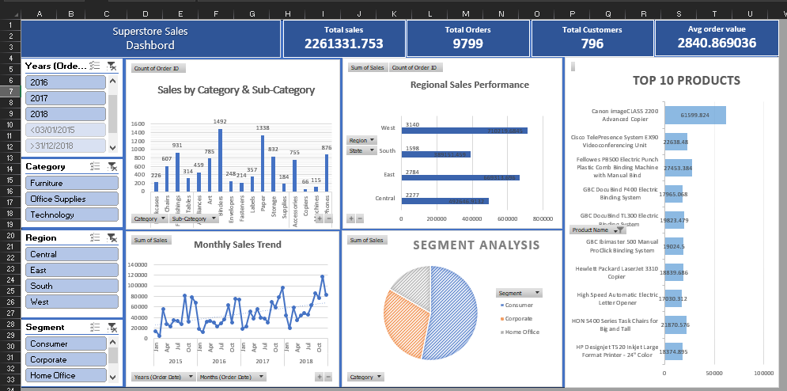

# Sales Performance Dashboard

This repository contains an Excel-based sales performance dashboard designed to monitor sales KPIs, spot trends, and evaluate business performance across key dimensions such as region, product, and salesperson.

## Overview

The dashboard provides a quick visual summary of:

- Total sales revenue
- Sales targets vs. actual performance
- Regional sales comparison
- Product/category contribution
- Sales trends over time
- Performance by representative or team

## Files in this repository

- `Sales_Performance_Dashboard.xlsx` — the main Excel workbook containing the dashboard and underlying analysis
- `Excel_Dashbord.png` — a preview image of the dashboard
- `README.md` — project documentation

## Dashboard preview

## How to use

1. Download or clone this repository.
2. Open `Sales_Performance_Dashboard.xlsx` in Microsoft Excel.
3. Enable Edit, Use the slicers, filters, and charts to explore performance by region, product, time period, and sales team.
4. Refresh the workbook if the source data is updated.

## Requirements

- Microsoft Excel 2016 or later
- Basic Excel knowledge for filtering and refreshing data

## Purpose

This dashboard is useful for sales analysis, management reporting, and business performance monitoring in a compact visual format.

## Notes

The workbook is intended for reporting and analysis, and may be customized to match specific business metrics or branding requirements.
